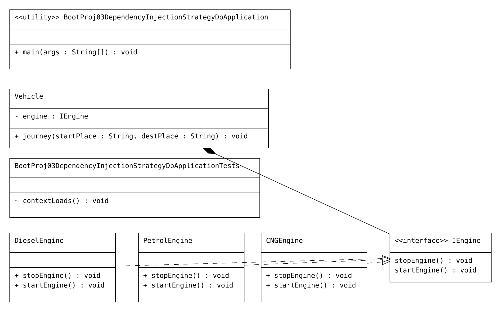

# Code

# Code

```Java
package com.vehicle.sbeans;

import org.springframework.beans.factory.annotation.Autowired;
import org.springframework.beans.factory.annotation.Qualifier;
import org.springframework.stereotype.Component;

@Component("vehicle")
public class Vehicle {
	@Autowired
	//@Qualifier("engine.id") --> invalid
	//@Qualifier("@Value("${engine.id}")) --> invalid
	@Qualifier("engg")
	private IEngine engine;
	
	//b,mehthod
	public   void  journey(String  startPlace,String destPlace) {
		System.out.println("Vehicle.journey()");
		engine.startEngine();
		System.out.println("Joueney started from ::"+startPlace);
		System.out.println("Journey is going on.........");
		
		engine.stopEngine();
		System.out.println("Joueney ended at ::"+destPlace);
	}
	
	

}
package com.vehicle.sbeans;

import org.springframework.stereotype.Component;

@Component("cEngine")
public final class CNGEngine implements IEngine {

    @Override
    public void startEngine() {
        System.out.println("CNGEngine.startEngine()");

    }

    @Override
    public void stopEngine() {
        System.out.println("CNGEngine.stopEngine()");

    }

}
package com.vehicle.sbeans;

import org.springframework.stereotype.Component;

@Component("dEngine")
public final class DieselEngine implements IEngine {

    @Override
    public void startEngine() {
        System.out.println("DieselEngine.startEngine()");

    }

    @Override
    public void stopEngine() {
        System.out.println("DieselEngine.stopEngine()");

    }

}
package com.vehicle.sbeans;

public interface IEngine {
    public  void startEngine();
    public  void stopEngine();
}
package com.vehicle.sbeans;

import org.springframework.stereotype.Component;

@Component("pEngine")
public final class PetrolEngine implements IEngine {

    @Override
    public void startEngine() {
        System.out.println("PetrolEngine.startEngine()");

    }

    @Override
    public void stopEngine() {
        System.out.println("PetrolEngine.stopEngine()");

    }

}
package com.vehicle;

import org.springframework.boot.SpringApplication;
import org.springframework.boot.autoconfigure.SpringBootApplication;
import org.springframework.context.ConfigurableApplicationContext;
import org.springframework.context.annotation.ImportResource;

import com.vehicle.sbeans.Vehicle;

@SpringBootApplication
@ImportResource("classpath:com/nt/config/applicationContext.xml")
public class BootProj03DependencyInjectionStrategyDpApplication {

    public static void main(String[] args) {
        // get IOC container
        ConfigurableApplicationContext ctx = SpringApplication
                .run(BootProj03DependencyInjectionStrategyDpApplication.class, args);
        // get target spring bean class obj ref
        Vehicle vehicle = ctx.getBean("vehicle", Vehicle.class);
        // invoke the b.method
        vehicle.journey("hyd", "goa");

        // close the container
        ctx.close();

    }

}
```

```xml
<?xml version="1.0" encoding="UTF-8"?>
<beans xmlns="http://www.springframework.org/schema/beans"
	xmlns:xsi="http://www.w3.org/2001/XMLSchema-instance"
	xmlns:context="http://www.springframework.org/schema/context"
	xsi:schemaLocation="http://www.springframework.org/schema/beans http://www.springframework.org/schema/beans/spring-beans.xsd
						http://www.springframework.org/schema/context http://www.springframework.org/schema/context/spring-context.xsd">

	<!-- Configure  the properties file here -->
	<context:property-placeholder location="classpath:application.properties" />

	<!-- provide  fixed alias name  for the bean id kept colleted from the
	properties file -->
	<alias name="${engine.id}" alias="engg" />


</beans>


```

```properties
spring.application.name=BootProj02-DependencyInjection-StrategyDP
#dependent bean id
engine.id=pEngine
```

# UML

